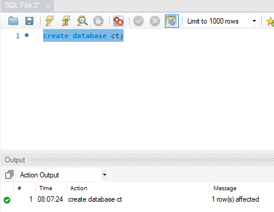

## To-Do Lsit

---

Esse é um projeto para auxiliar no controle de tarefas

---

             Tecnologias Utilizadas  

- IDE:[ Visual studio Code].
- SGBD: [ MySQL Workbench].
- Framework: [Laravel V8.x]

---
    OBSERVAÇÕES:
    ->O servidor smtp configurado e o "outlook", estou enviando o e-mail e a senha de teste, caso a aplicação mostre algum erro relacionado a isso, é preciso configurar outro e-mail no arquivo .env, o erro acontece pois o Outlook bloqueia o envio de e-mail:

    ->email: teste_tt17@outlook.com
    ->senha: mnvp11172819
---

        Instalação

- Faça o donwload do arquivo do projeto 
---
- Configurar a conexão do banco de dados no arquivo . env  como é mostrado a baixo.

---

- Criação de um banco de dados no MySQL Workbench.

    -> Use o comando: create database ct;

---

- Execute as migrate no terminal, utilizando o comando: php artisan migrate, se a criação das migrate for bem sucedido, você terá um resultado como o mostrado a baixo.

- Agora chegou a hora da diversão, vamos criar um servidor para nossa aplicação, é bem simples, execulte o comando: php artisan serve em seu terminal.

clique no link e a aplicação irá abrir em seu navegador.

---
             Como Utilizar

- Para acessar a aplicação é preciso fazer login, mas se for o seu primeiro acesso você pode se registrar de forma rapida e simples.
---

        Telas

- A tela home é uma tela simples, que lhe permite fazer login ou ser cadastrar na aplicação,
se for seu primeiro acesso você precisa realizar seu cadastro.

-Você será direcionado para uma tela que pedira para você validar seu e-mail, nela tem algumas explicações:

- Será enviado um e-mail para você validar sua conta, mas é necessario abrir seu e-mail na mesma maquina que seu aplicação está rodando,
pois o servidor é local.

Confirmação de e-mail:

- Clicando no botão você sera redirecionado para aplicação:

    Funcionalidades

-Cadastrar tarefa Clicando em novo:

- Quando você cadastra uma tarefa um e-mail é enviado falando sobre a tarefa cadastrada e permitindo que você consulte clicando no botão

- Tarefa cadastrada
    -> a aplicação te direciona para a vizualização da tarefa, onde voce pode voltar e editar ela novamente, ou clicando no link tarefa que 
    você sera direcionado para a pagina inicial.

- Já é possivel ver a tarefa, com suas respectivas informações:

Funcinalidades:
    
->Login

->Cadastro

->Validação de E-mail

->Notifação de tarefa Cadastrada no e-mail

-> criação, edição, exclusão e visualização de tarefas cadastradas

-> imprimir tarefas no formato PDF: como é mostrado a baixo:

-> cliando em download tarefas(pdf), é aberta uma nova guia para impressão.

